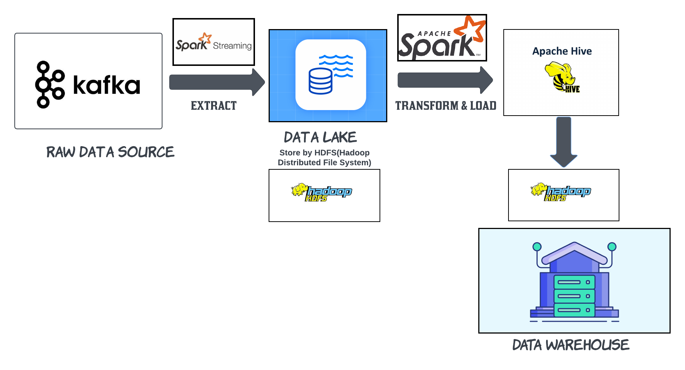

# BIG DATA WITH DOCKER-COMPOSE AND END TO END DEMO
---
## Watch the video Demo [Here](https://www.youtube.com/watch?v=8Y1ThOduNaM)
---
### Tech stack:
- Hadoop version: 3.2.4
- Hive version: 3.1.3
- Spark version: 3.3.2
- Kafka version: 3.3.2
---
## BUILDING BIG DATA TOOLS FROM DOCKER IMAGE

- To get start, you can take a few minutes to visit to my project of building and set up big-data tools from scratch with docker image to know more about what I did with the docker image via this [repo](https://github.com/ntbs1798/big-data-tools-docker-image).
- The reason why I built this project is to deploy my own big-data-tools for personal data handling, and I will be no longer need to use the Cloudera or Hortonworks Sandbox for these tools. Also, I can myself update and config the newest version of hadoop, spark, kafka, hive, etc

---

### STEP TO BUILD:

#### 1. DOCKER AND DOCKER-COMPOSE SETUP:

- Please refering to the docker main page for downloading and setting up the docker for your desktop through [here](https://docs.docker.com/desktop/) for docker desktop and [here](https://docs.docker.com/compose/) for docker compose

#### 2. BUILDING BY DOCKER-COMPOSE:

- Make sure docker is running properly in your machine, turn on the command line in the folder big-data-tools-docker-composed-master, and let's start
- First, run docker-compose command below:

```bash
~/ docker-compose -f ./docker-compose.yml up
```

- Second, after pulling image and run the image, we can jump in to the container to make sure everything is working by:

```bash
~/ docker exec -it bigdata-tools /bin/bash
```

- Last, you can now enjoy the ubuntu machine with big data tools(hadoop,spark,hive,kafka)

---

## RUNNING END TO END BIG DATA DEMO

### Architecture:

- The image below describe full etl process (from kafka raw source to final structure data warehouse)



### Step to run the demo:

---

#### Step 1: Set up environment

- In the beginning, make sure your container is running via STEP TO BUILD part, then jump into the container. Now, you can type command for the container.

- Next, you have to edit the .bashrc file with command: "~/ vi .bashrc" and export these ports:

```bash
export PATH=/PATH:/HIVE_HOME/bin
export PATH=/PATH:/SBT_HOME/bin
export PATH=/PATH:/SCALA_HOME/bin
export PATH=/PATH:/SPARK_HOME/bin:/SPARK_HOME/sbin
```

After edit the file, just save it and run the command: "~/ source .bashrc"
This step is important as it export the port for environment to run softwares.

- Ok, env is setted up, let's run our softwares

#### Step 2: Running hadoop and hive

```bash
#Start ssh server
~/ service ssh start
# Start hadoop hdfs
~/ start-dfs.sh
#grain permission for hive to write
~/ hadoop fs -mkdir -p /hive/warehouse
~/ hadoop fs -mkdir -p /tmp
~/ hadoop fs -chmod g+w /hive/warehouse
~/ hadoop fs -chmod g+w /tmp
#innitialize schema for hive
~/ schematool -initSchema -dbType derby
#We are now ready to enter the Hive shell and create the database for holding data. Next, we need to start the Hive Metastore server with the following command.
~/ hive --services metastore
```

#### Step 3: Running zookeeper and kafka server

- Next, we have to open 2 another command line for the container to run zookeeper as well as kafka server

first cli:

```bash
~/ /kafka_2.12-3.3.2/bin/zookeeper-server-start.sh /kafka_2.12-3.3.2/config/zookeeper.properties
```

second cli:

```bash
~/ /kafka_2.12-3.3.2/bin/kafka-server-start.sh /kafka_2.12-3.3.2/config/server.properties --override advertised.listeners=PLAINTEXT://localhost:9092
```

#### Step 4: Sending fake data and using spark to ingest and transform data

- Now, we have all the server that we need running, let's start to send data and consume it.

  In the python_code folder, you will see fakeData.py file, which you can run it localy in your host machine by python. However, you will need to install kafka-python and pandas libraries.

  ```bash
  pip install kafka-python
  pip install pandas
  ```

- Then, let's ingest the data by spark:

```bash
~/ spark-submit --packages org.apache.spark:spark-sql-kafka-0-10_2.12:3.3.2 /python_code/ingestData.py
```

- Next, we can write it into hdfs through hive

```bash
~/ spark-submit /python_code/transform.py
```

## STOP ALL SERVICE

- If you don't want the container to keep running, you can easily stop it by:

```bash
~/ docker-compose -f ./docker-compose.yml down

```
